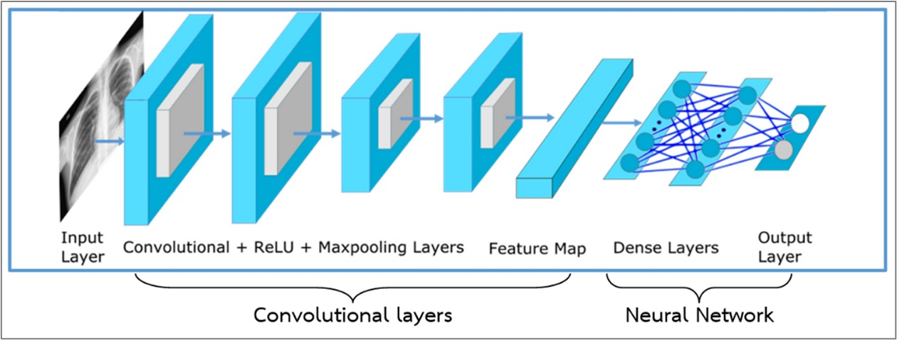

# Chest X-Ray classification for tuberculosis and lung cancer  by machine learning algorith
## Senior Project [Link](https://drive.google.com/file/d/1yGd7HzOW5bCSdhWtzmNXORYfdoAf2A4V/view?usp=sharing)

   
    โมเดล DenseNet201 มีทั้งหมด 709 layers แบ่งเป็น ชั้นของ Convolutional Neural Network (CNN) 707 layers และ Neural Network (NN) 2 layers 
    โมเดล แต่ละเลเยอร์ ใน CNN จะมี Initial Weight หรือ Weight เริ่มต้นมาด้วย 
    

     
    
   Pretrained
   
    Pretrained คือ การใช้ Weight จากโมเดลที่เทรนมาแล้ว นำมาเป็น Initial Weight หรือ Weight เริ่มต้นของการเทรนโมเดลด้วยชุดข้อมูลของเรา (CXR img) 
    แล้วเทรนโมเดลเพื่อหา Weight ใหม่เฉพาะ Neural Network เพื่อให้ได้ Weight ที่เหมาะสมกับชุดข้อมูลของเรา
    ยกตัวอย่าง โมเดล DenseNet201 การเทรนโมเดลในชั้นของ CNN จะใช้ Initial Weight ส่วนในชั้น NN จะเป็นการเทรนหา Weight ใหม่ 
    
   Finetune
   
    Finetune คือ การเทรนโมเดลเพื่อหา Weight ใหม่ ในทุก layer โดยใช้ชุดข้อมูลของเรา (CXR img)
    
   ปล. ชุดข้อมูลของเรา (CXR img) คือ ภาพเอกซเรย์ทรวงอกของปอดปกติ มะเร็งปอด และวัณโรค รวมทั้งหมด 450 ภาพ
